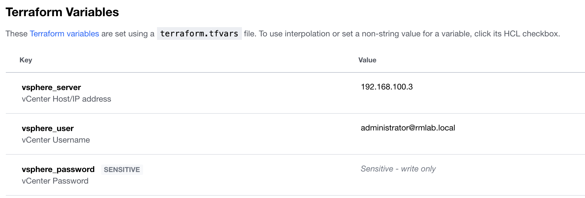

# Deploying Compute Server Resources using Cisco Intersight Service for HashiCorp Terraform

## Overview

Cisco Intersight Service for HashiCorp Terraform (IST) addresses the challenge of securely connecting and configuring on-premises and hybrid environments to work with Terraform Cloud Business Tier. Leveraging Intersight Assist, users can integrate Terraform Cloud Business with Cisco Intersight, enabling secure communication between on-premises data centers and edge locations with the IaC platform. This means users can spend less time managing the end-to-end lifecycle of Terraform Cloud Agents, benefiting from native integration directly within Intersight, including upgrades and the ability to scale as demand grows.

In this example, we cover a simple use case that the Intersight Platform and Terraform Cloud Business Tier to deploy servers divided in category: load balancer, application and database. This use case will walk the user through the following steps.

1. Adding your Terraform Cloud for Business Tier Credentials
2. Adding your Terraform Cloud Agent
3. Setting the tamplete for the creation of VMs
4. Executing Terraform Code to deploy virtual servers

This use case includes a Terraform Module that is being used to create a number of Vms based on a template. The Terraform module is in the server folder. 

## Requirements

1. Intersight SaaS platform account with Advantage licenses
2. An Intersight Assist appliance that is connected to your Intersight environment
3. Terraform Cloud Business Tier Account
4. vCenter Server Access
5. DHCP server to allocate ip addresses dynamically
5. GitHub account to host your Terraform code


## Steps to Deploy Use Case


### Setup Terraform Cloud Business Tier Account

To add your Terraform Cloud credentials in Intersight you will need the following:
1. Terraform Cloud Username
2. Terraform Cloud API Token
3. Terraform Cloud Organization

Login to Intersight and claim your Terraform Cloud target.

### Claim Terraform Agent

Once the target is created, the agent can be added assist. 

### Create GitHub Repo

1. Go to https://github.com/CiscoDevNet/ist-cookbook/tree/main/devops-dev
2. Fork it into your own GitHub account

### Datacenter Prep

Create a template for a linux VM. This could be either CentOS or Ubuntu. Make sure you have VMware tools pre installed on the VM. We will use this template to a create a VM in the datacenter.


### Create Workspace in Terraform Cloud

Two options are available to create a new workspace:

1. Create a new workspace using Terraform itself: looks for  https://github.com/CiscoDevNet/ist-cookbook/tree/main/tfc4b_provisioning
1. Create manualli a new workspace  by loggin into Terraform Cloud and choose a version control provider (setup in the previous step) that hosts the Terraform configuration for this workspace. Then go the Variables section and add the following variables with the value specific to your environment (the values provided below are examples)

| Key                |   Value          | Type         |
|--------------------|------------------|--------------|
| vsphere_server | 10.x.x.x||
| vsphere_user | administrator@vsphere.local||
| vsphere_password | ******** | Sensitive |


 

### Configure the servers
Specify the folllwing variable as Map Object:

 - common_vm_spec represent the common configuration for all VMs that will be created

```
common_vm_specs = {
  virt_hypervisor_type = "ESXi"
  vm_adaptor_type      = "vmxnet3"
  vm_template_path     = "/RMLAB/vm/Templates/tf-centos7"
  vc_datacenter        = "RMLAB"
  vc_datastore         = "JOHNNY01_DATASTORE01"
  vc_cluster           = "RMLAB - Workloads"
  vm_folder            = "/RMLAB/vm/sgioia"
  vc_network           = "192.168.130"
}
```
 - vms the list of VMs that will be created. Note that this list might a custom datastore and network if you want to override what's configured in the common_vm_specs.

```
vms = {
  frontend = {
    instances   = 1
    vCPU        = 2
    vMEM        = 4096
    vmname      = "frontend"
    datastore   = "JOHNNY01_DATASTORE01"
    network     = "192.168.130"
    hostname    = "frontend"
    domain_name = "rmlab.local"
  }
  backend = {
    instances   = 1
    vCPU        = 4
    vMEM        = 8192
    vmname      = "backend"
    datastore   = "JOHNNY01_DATASTORE01"
    network     = "192.168.130"
    hostname    = "backend"
    domain_name = "rmlab.local"
  }
  loadbalancer = {
    instances   = 1
    vCPU        = 2
    vMEM        = 4096
    vmname      = "loadbalancer"
    datastore   = "JOHNNY01_DATASTORE01"
    network     = "192.168.130"
    hostname    = "loadbalancer"
    domain_name = "rmlab.local"
  }
}
```

### Execute Deployment

To execute the Terraform code in your datacenter click on the ***Queue Plan Manually*** button 
    

## Results

You will see a couple of servers (virtual machine ) depenting on the number of istance you've configured in the variable instances

## Related Sandbox

Get hands on experience with Intersight Service for Terraform in DevNet's Sandbox environment.

[Cisco Intersight Service for HashiCorp Terraform](https://devnetsandbox.cisco.com/RM/Diagram/Index/055e2dce-fdfd-4d26-a112-72b884ddd7c7?diagramType=Topology)

## Links to DevNet Learning Labs

Learn how to provision virtual machines in vSphere using Intersight Service for Terraform.

[Introduction to Intersight Service for Hashicorp Terraform](https://developer.cisco.com/learning/lab/intersight-01-ist-introduction/step/1)
[Provisioning VMs using Intersight Terraform Service for Hashicorp](https://developer.cisco.com/learning/lab/intersight-02-ist-vm-automation/step/1)


